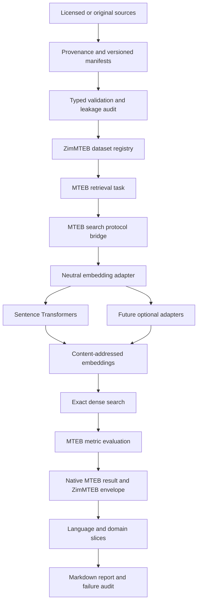
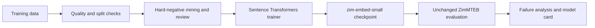
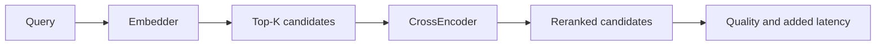

# Architecture

ZimMTEB owns task data, governance and experiment context. MTEB executes retrieval
evaluation; Sentence Transformers loads and encodes models behind a neutral adapter.
All models, including future locally adapted ones, follow the same route.

`config.py` loads validated declarative registries from checkout or packaged resources.
`datasets/` owns schemas, loading and validation. `models/` is the model boundary.
`tasks.py` is the isolated MTEB compatibility surface. `runner.py` orchestrates the
run, seeds, manifests and cleanup. `metrics.py` derives per-query audit metrics with
the same trec_eval engine; an integration test checks agreement with MTEB aggregate
nDCG. `results.py` defines the exchange schema; `reporting.py` preserves all slices.

The small module layout deliberately avoids empty manager/factory hierarchies. Training,
mining and non-retrieval task modules will be introduced with real implementations.

Future training (not implemented):

Future reranking (not implemented):

